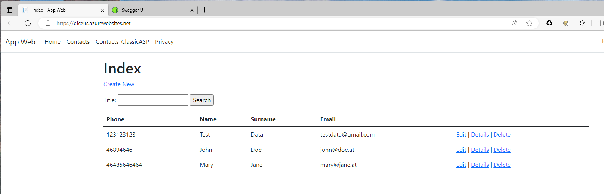
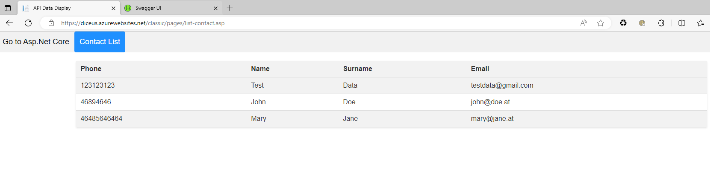
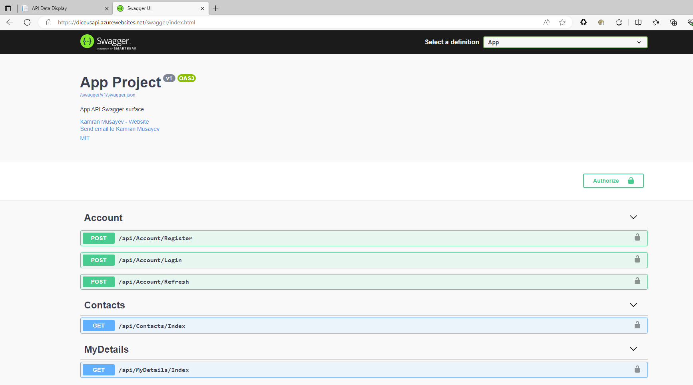

# Diceus Task

Installing a project in a Docker container
1. Open PowerShell
2. Go to the root folder of the project, where the docker-compose.yml file is located
3. Run command

   ``` powershell
   docker-compose --env-file ./config/docker.development.env up -d
   ```





